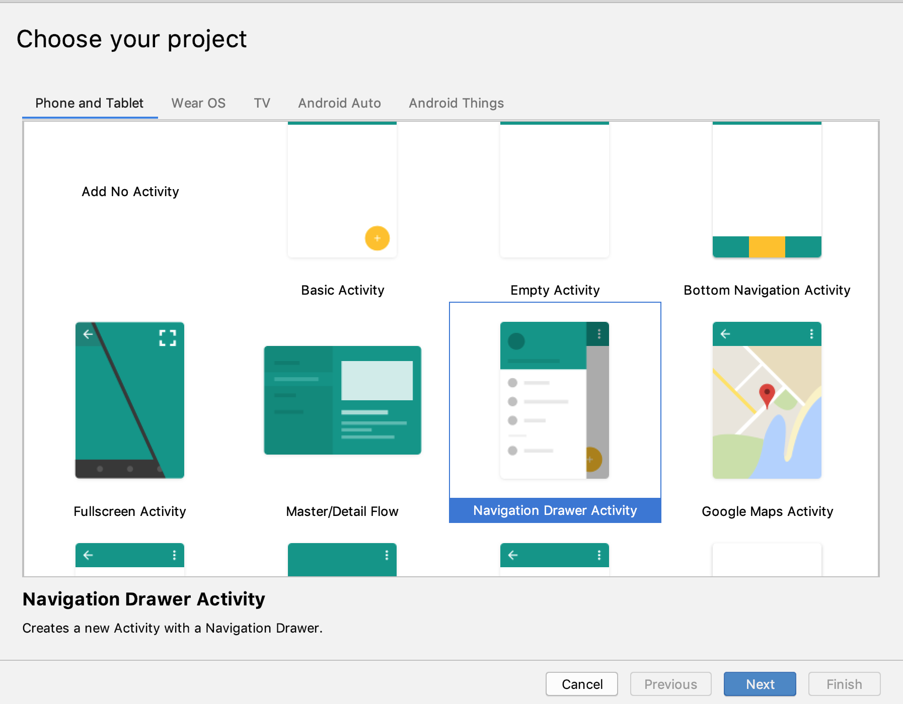
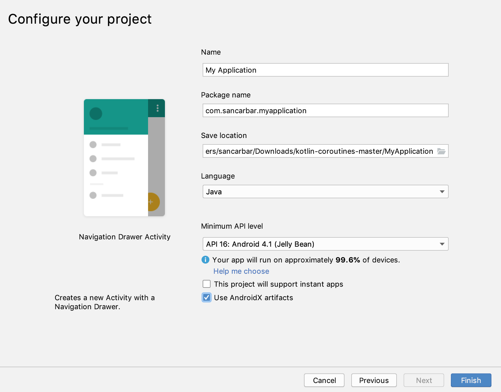
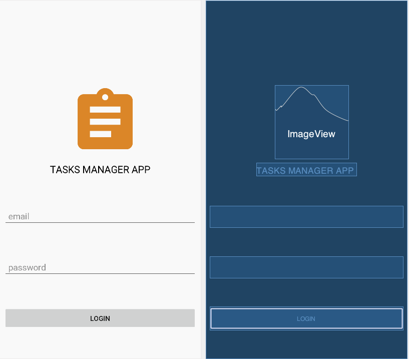

# Android-Secure-REST-API


#### Part 1: Launch Activity and Login Activity 

1. Create a new application from the application templates with a *Navigation Drawer Activity*.
    
    

2. Check the AndroidX artifacts options and click *finish*

    
    
3. Create a new class Activity called *LoginActivity* and add it to *AndroidManifest.xml*.

4. Create a new class Activity called *LaunchActivity* and add it to *AndroidManifest.xml*.

5. Change your *AndroidManifest.xml* so the *LaunchActivity* has the action MAIN and LAUNCHER CATEGORY.

    ```xml
    <?xml version="1.0" encoding="utf-8"?>
    <manifest package="com.sancarbar.myapplication"
              xmlns:android="http://schemas.android.com/apk/res/android">
    
      <application
          android:allowBackup="true"
          android:icon="@mipmap/ic_launcher"
          android:label="@string/app_name"
          android:roundIcon="@mipmap/ic_launcher_round"
          android:supportsRtl="true"
          android:theme="@style/AppTheme">
        <activity
            android:name=".LaunchActivity"
            android:label="@string/app_name"
            android:theme="@style/AppTheme.NoActionBar">
          <intent-filter>
            <action android:name="android.intent.action.MAIN" />
    
            <category android:name="android.intent.category.LAUNCHER" />
          </intent-filter>
        </activity>
    
        <activity android:name=".LoginActivity"/>
        <activity android:name=".MainActivity"/>
    
    
      </application>
    
    </manifest>
    ```
6. Read and understand how *SharedPreferences* work on Android
    https://developer.android.com/training/data-storage/shared-preferences#java
    
7. Use the SharedPreferences to verify in the *LaunchActivity* if the user has been authenticated or not:
   ```java
    public class LaunchActivity
        extends AppCompatActivity
    {
    
        public static final String TOKEN_KEY = "TOKEN_KEY";
    
        @Override
        protected void onCreate( @Nullable Bundle savedInstanceState )
        {
            super.onCreate( savedInstanceState );
            SharedPreferences sharedPref =
                getSharedPreferences( getString( R.string.preference_file_key ), Context.MODE_PRIVATE );
    
            if(sharedPref.contains(TOKEN_KEY)){
                //TODO go to MainActivity
            }else{
                //TODO go to LoginActivity
            }
        }
    }

   ```
8. Implement the *LoginActivity* Layout: 

      
      
9. Implement a function that validates the input fields when the *Login* Button is clicked (use the *setError* method to show the error messages to the user)

#### Part 2: Network Layer Implementation

1. Read and understand the Retrofit library documentation:
    https://square.github.io/retrofit/
    
2. Add the Internet permission to your app on your *AndroidManifest.xml*

    ```xml
    <?xml version="1.0" encoding="utf-8"?>
    <manifest package="com.sancarbar.myapplication"
              xmlns:android="http://schemas.android.com/apk/res/android">
    
     <uses-permission android:name="android.permission.INTERNET"/>
 
      <application
          android:allowBackup="true"
          android:icon="@mipmap/ic_launcher"
          android:label="@string/app_name"
          android:roundIcon="@mipmap/ic_launcher_round"
          android:supportsRtl="true"
          android:theme="@style/AppTheme">
     ...
    
      </application>
    
    </manifest>
    ```      
    
3. Add the *Retrofit* library dependency to your *build.gradle* (app).

4. Add the *Gson* converter dependency to your *build.gradle* (app).   

    ```xml
      com.squareup.retrofit2:converter-gson:<retrofit-version>
    ``` 
5. Create a Token class that matches the Token response from the API when the authentication is successful.

6. Create a POJO called *LoginWrapper* that represents the Login object send to the API (String email and String password).

7. Create a AuthService interface with @POST declaration to call the auth endpoint of the provided API.

8. Instantiate the Retrofit class and service as shown on the documentation: 
   ```java
    Retrofit retrofit = new Retrofit.Builder()
        .baseUrl("http:/10.0.2.2:8080") //localhost for emulator
        .addConverterFactory(GsonConverterFactory.create())
        .build();
    
    AuthService authService = retrofit.create(AuthService.class);

   ```
   
9. Connect the logic of the *LoginActivity* so when the Login form is fill and is correct then call the *authService.login* method.

10. If your App crashed no worries this happens all the time. Read the console on the *Logcat* tab and find out why the error happened.

    hint:   https://developer.android.com/guide/components/processes-and-threads 

11. Create an instance of the ExecutorService class. This will allow you to switch to the background thread to be able to make the  API Request.
   ```java
   private final ExecutorService executorService = Executors.newFixedThreadPool( 1 );

   ```
   
12. Change the onLoginClicked method so it calls the *authService* using the *ExecutorService*

   ```java
     public void onLoginClicked( View view )
        {
            executorService.execute( new Runnable()
            {
                @Override
                public void run()
                {
                    try
                    {
                        Response<Token> response =
                            authService.login( new LoginWrapper( "test@mail.com", "password" ) ).execute();
                        Token token = response.body();
                    }
                    catch ( IOException e )
                    {
                        e.printStackTrace();
                    }
                }
            } );
        }

   ```
   
    Note: Be aware that if you need to update your UI again, you will need to switch back the UI thread by calling the *runOnUiThread()* method that belongs to the Activity class.
    
13. Store the access token on the *SharedPreferences* and start the *MainActivity*.

14. Close your App and open it again. Verify that *LaunchActivity* takes you directly to the *MainActivity*.

15. Implement a *logout* function that clears the Token from the *SharedPreferences* and redirects to the *LoginActivity* (Do not forget to call finish() on the MainActivity to remove it from the activities stack).
